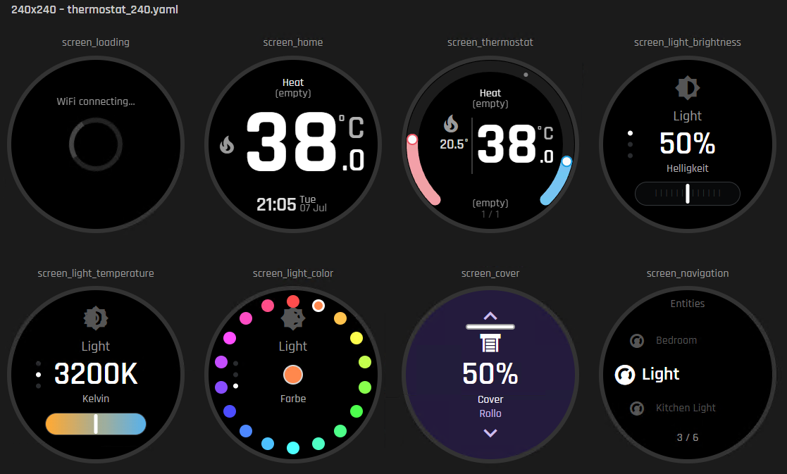
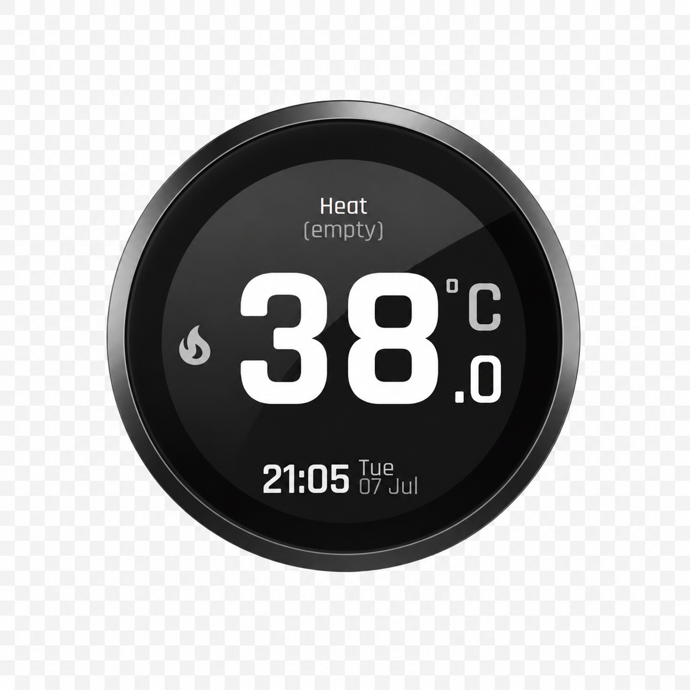
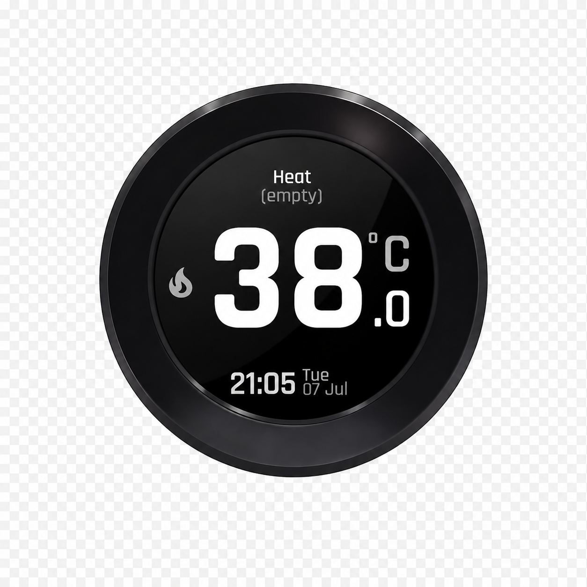
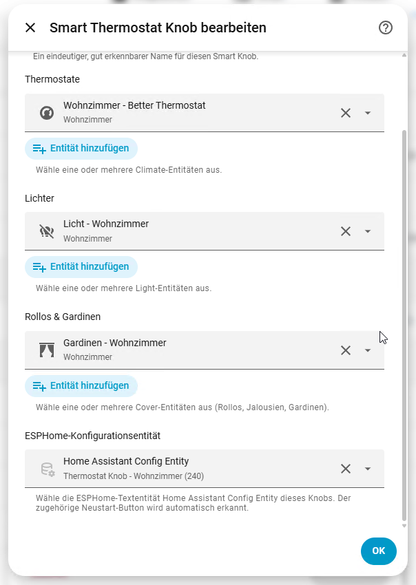

# Smart Thermostat Knob — Home Assistant Integration


[](https://my.home-assistant.io/redirect/hacs_repository/?owner=Jastreb07&repository=elecrow-crowpanel-esphome-thermostat-integration&category=integration)

This is the companion Home Assistant integration for the
[Smart Thermostat Knob firmware](https://github.com/Jastreb07/elecrow-crowpanel-esphome-thermostat)
(ESPHome firmware for Elecrow CrowPanel ESP32-S3 rotary displays). It is a
configuration helper only — it does not add new entities to Home Assistant
and does not talk to the ESP device over the network. It creates one
configuration sensor per physical Smart Knob and exposes the climate, light,
and cover entities you pick for it, in the JSON attribute format the
firmware reads.

If you don't have the firmware installed on a device yet, start there —
this integration has nothing to configure without it:
**[Smart Thermostat Knob firmware repository](https://github.com/Jastreb07/elecrow-crowpanel-esphome-thermostat)**.

The firmware (and by extension the climate entities you select here) is
tuned to work well with [Better Thermostat](https://better-thermostat.org/)
— that's what I personally run mine with.

## Video Walkthrough

| 1.28" (240x240) | 2.1" (480x480) |
|---|---|
| [](https://www.youtube.com/watch?v=F0mFrxt4jac) | [](https://www.youtube.com/watch?v=REPLACE_WITH_480_VIDEO_ID) |

## Screens

The knob's on-device screens, controlled by this integration's entity
selection:



## Hardware

| CrowPanel 1.28" (240x240) | CrowPanel 2.1" (480x480) |
|---|---|
| [](https://www.elecrow.com/crowpanel-1-28inch-hmi-esp32-rotary-display-240-240-ips-round-touch-knob-screen.html) | [](https://www.elecrow.com/crowpanel-2-1inch-hmi-esp32-rotary-display-480-480-ips-round-touch-knob-screen.html) |

## Installation via HACS

1. Click the badge above, or in Home Assistant open **HACS > Integrations >
   the three-dot menu (top right) > Custom repositories**, add
   `https://github.com/Jastreb07/elecrow-crowpanel-esphome-thermostat-integration`
   as category **Integration**.
2. Search for **Smart Thermostat Knob** in HACS and install it.
3. Restart Home Assistant.
4. Continue with [Setting Up a Smart Knob](#setting-up-a-smart-knob) below.

## Manual installation

Copy this repository's contents to the Home Assistant configuration
directory as:

```text
/homeassistant/custom_components/smart_thermostat_knob
```

Restart Home Assistant, then continue with the setup steps below.

## Setting Up a Smart Knob

Do this once per physical Smart Knob, after the integration itself is
installed (HACS or manual) and Home Assistant has been restarted, and
after that knob's firmware is already flashed and connected to Wi-Fi (see
the [firmware repo](https://github.com/Jastreb07/elecrow-crowpanel-esphome-thermostat)
if it isn't yet).

1. Go to **Settings > Devices & services > Add integration**, search for
   **Smart Thermostat Knob**, and select it. Because this integration is a
   Home Assistant *helper*, you can also create it from
   **Settings > Devices & services > Helpers > + Create Helper**, search
   for **Smart Thermostat Knob** there instead — both paths open the same
   form.
2. Fill in the form:
   - **Smart Knob name** — a unique, recognizable name (for example
     "Living Room Knob"). Home Assistant derives this entry's sensor
     entity ID from it, e.g. `sensor.living_room_knob_config`.
   - **Thermostats** — one or more `climate.*` entities. **Required**; the
     form rejects submission without at least one.
   - **Lights** — any `light.*` entities to add as pages. Optional.
   - **Covers** — any `cover.*` entities (shutters, blinds, curtains) to
     add as pages. Optional.
   - **ESPHome config entity** — the knob's own ESPHome text entity named
     **Home Assistant Config Entity**. Optional, but recommended: picking
     it here lets the integration write the new sensor's entity ID into
     the device for you and restart it automatically, instead of you
     copying that entity ID over by hand (see step 4 if you skip this).


  

3. Submit the form. This creates the config entry and its sensor
   (`sensor.<name>_config`, with your climate/light/cover selection encoded
   as its JSON attributes) — check under **Settings > Devices & services >
   Smart Thermostat Knob** that it appears.
4. **If you selected the ESPHome config entity in step 2**, the ESP
   restarts on its own within a few seconds and picks up the new pages —
   nothing else to do. **If you left it empty**, open the device's
   **Home Assistant Config Entity** text entity yourself and set its value
   to the sensor entity ID from step 3 (e.g. `sensor.living_room_knob_config`);
   the ESP applies it immediately without a restart.
5. Confirm on the physical device: the thermostat, light, and cover pages
   you selected should now be reachable from the entity overview screen.

The screen order follows the selector order from step 2, and on-device
display names come from the Home Assistant friendly names of the entities
you picked — rename the entity and reload this integration to change what
shows on screen.

Repeat **Add integration** (or **Create Helper**) for every additional
Smart Knob; each gets its own independent config entry and sensor. To
rename a knob or change its entities later, either open that specific
entry under **Settings > Devices & services > Smart Thermostat Knob** and
select **Reconfigure**, or edit it directly from
**Settings > Devices & services > Helpers** (click the entry, then the
gear/settings icon) — both open the same editable form. Other Smart Knob
entries are not affected.

## Related

- [Smart Thermostat Knob firmware](https://github.com/Jastreb07/elecrow-crowpanel-esphome-thermostat) —
  the ESPHome firmware this integration configures. See its
  [SETUP.md](https://github.com/Jastreb07/elecrow-crowpanel-esphome-thermostat/blob/master/SETUP.md#home-assistant-setup)
  for the full Home Assistant setup flow, including the manual
  Template-Entity alternative to this integration.
