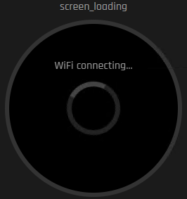
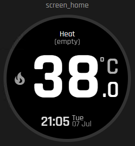
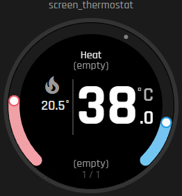
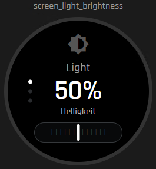
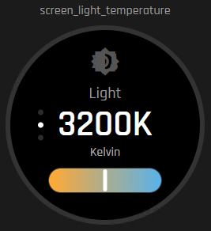
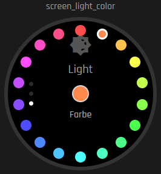
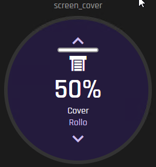
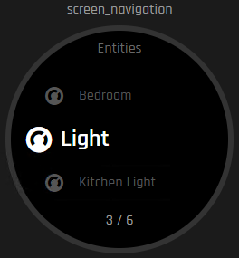

# Smart Thermostat Knob — Home Assistant Integration

[](https://my.home-assistant.io/redirect/hacs_repository/?owner=Jastreb07&repository=elecrow-crowpanel-esphome-thermostat-integration&category=integration)

This is the companion Home Assistant integration for the
[Smart Thermostat Knob firmware](https://github.com/Jastreb07/elecrow-crowpanel-esphome-thermostat)
(ESPHome firmware for Elecrow CrowPanel ESP32-S3 rotary displays). It is a
configuration helper only — it does not add new entities to Home Assistant
and does not talk to the ESP device over the network. It creates one
configuration sensor per physical Smart Knob and exposes the climate, light,
and cover entities you pick for it, in the JSON attribute format the
firmware reads.

If you don't have the firmware installed on a device yet, start there —
this integration has nothing to configure without it:
**[Smart Thermostat Knob firmware repository](https://github.com/Jastreb07/elecrow-crowpanel-esphome-thermostat)**.

## Video Walkthrough

| 1.28" (240x240) | 2.1" (480x480) |
|---|---|
| [](https://www.youtube.com/watch?v=F0mFrxt4jac) | [](https://www.youtube.com/watch?v=REPLACE_WITH_480_VIDEO_ID) |

GitHub strips `<iframe>` embeds from rendered READMEs, so a YouTube video
can't play inline here — clicking a thumbnail opens it on YouTube instead.
Once we have local `.mp4` exports of these recordings, we can switch to a
native `<video>` tag pointing at a file committed to this repo, which
GitHub *does* play inline without leaving the page.

## Screens

The knob's on-device screens, controlled by this integration's entity
selection:

| Loading | Home | Thermostat |
|---|---|---|
|  |  |  |

| Light brightness | Light temperature | Light color |
|---|---|---|
|  |  |  |

| Cover | Entity navigation |
|---|---|
|  |  |

## Hardware

| CrowPanel 1.28" (240x240) | CrowPanel 2.1" (480x480) |
|---|---|
| [](https://www.elecrow.com/crowpanel-1-28inch-hmi-esp32-rotary-display-240-240-ips-round-touch-knob-screen.html) | [](https://www.elecrow.com/crowpanel-2-1inch-hmi-esp32-rotary-display-480-480-ips-round-touch-knob-screen.html) |

## Installation via HACS

1. Click the badge above, or in Home Assistant open **HACS > Integrations >
   the three-dot menu (top right) > Custom repositories**, add
   `https://github.com/Jastreb07/elecrow-crowpanel-esphome-thermostat-integration`
   as category **Integration**.
2. Search for **Smart Thermostat Knob** in HACS and install it.
3. Restart Home Assistant.
4. Continue with **Settings > Devices & services > Add integration** below.

## Manual installation

Copy this repository's contents to the Home Assistant configuration
directory as:

```text
/homeassistant/custom_components/smart_thermostat_knob
```

Restart Home Assistant. Then open **Settings > Devices & services > Add
integration**, search for **Smart Thermostat Knob**, give the knob a
recognizable name, and select its climate, light, and cover entities.
Repeat **Add integration** for every additional Smart Knob.


Optionally select the knob's ESPHome text entity **Home Assistant Config
Entity**. The integration writes its own configuration sensor entity ID to
that text entity and automatically finds the restart button on the same
ESPHome device. The ESP restarts once after initial mapping and after every
later reconfiguration of this helper.

To rename a knob or change its assigned entities later, open that specific
integration entry and select **Reconfigure**. Other Smart Knob entries are
not affected.

At least one climate entity is required. Light and cover entities are
optional. The screen order follows the selector order, and display names
come from the Home Assistant friendly names. To change a displayed name,
rename the entity and reload this integration.

Each entry creates its own sensor, with an entity ID derived from the
chosen name, for example `sensor.living_room_knob_config`. If that ID is
already used, Home Assistant adds a suffix. Set the corresponding ESPHome
text entity **Home Assistant Config Entity** to that knob's actual sensor
entity ID. The value is persisted by the ESP.

## Related

- [Smart Thermostat Knob firmware](https://github.com/Jastreb07/elecrow-crowpanel-esphome-thermostat) —
  the ESPHome firmware this integration configures. See its
  [SETUP.md](https://github.com/Jastreb07/elecrow-crowpanel-esphome-thermostat/blob/master/SETUP.md#home-assistant-setup)
  for the full Home Assistant setup flow, including the manual
  Template-Entity alternative to this integration.
